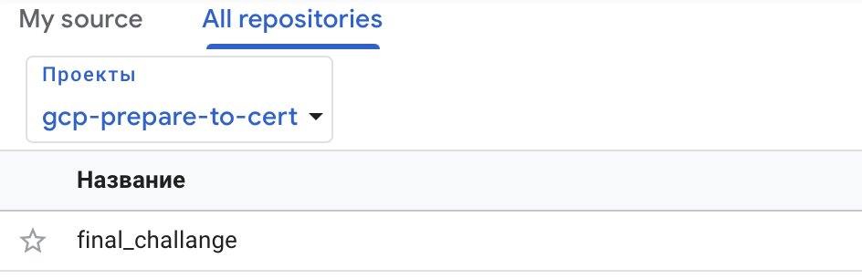
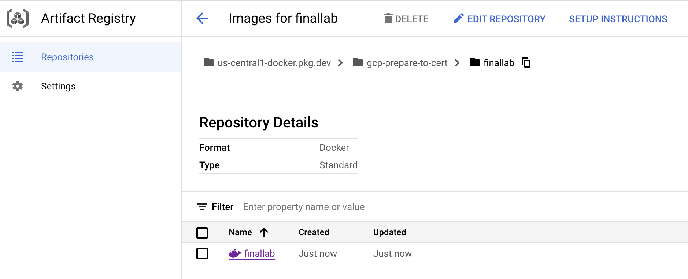
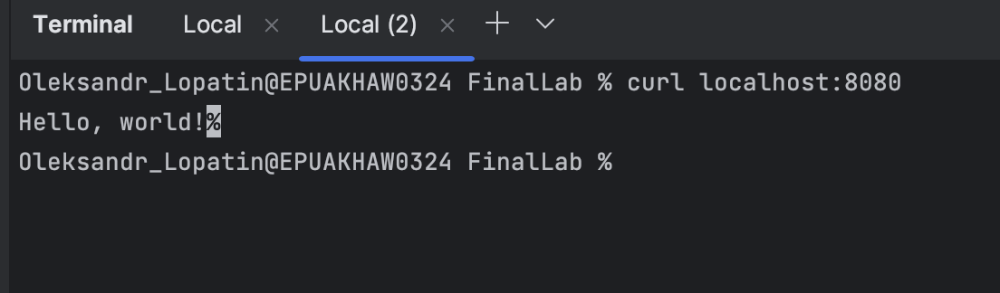

Step 1
gcloud auth login
gcloud source repos create [REPOSITORY_NAME]
gcloud source repos clone [REPOSITORY_NAME]
push app to repo, you can see repo 
docker build -t [DOCKER_IMAGE_NAME] .
docker tag [DOCKER_IMAGE_NAME] us-central1-docker.pkg.dev/[PROJECT_ID]/[REPOSITORY_NAME]/[DOCKER_IMAGE_NAME]:[TAG]
gcloud auth configure-docker us-central1-docker.pkg.dev
docker push us-central1-docker.pkg.dev/[PROJECT_ID]/[REPOSITORY_NAME]/[DOCKER_IMAGE_NAME]:[TAG]

Test result:

Step 2
Trigger for pipeline

Step 3
